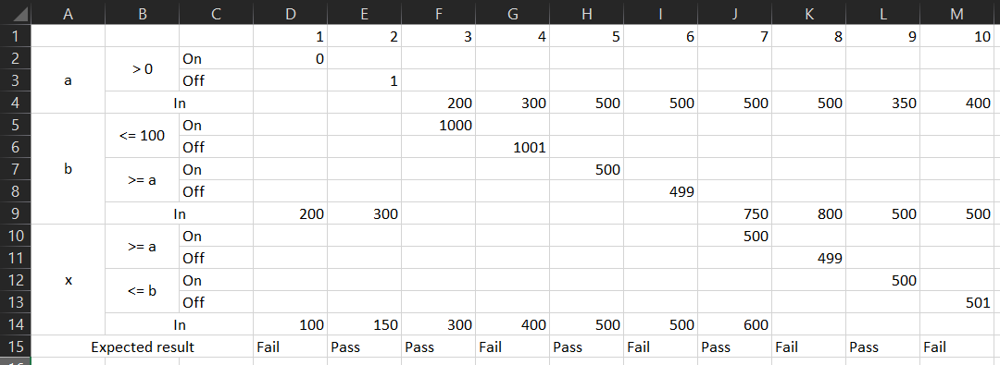

# Notes <!-- omit in toc -->

<details>
<summary>Table of Contents</summary>

- [Exercise 1](#exercise-1)
  - [Conditions:](#conditions)
  - [Points:](#points)
  - [Domain matrix:](#domain-matrix)
- [Exercise 2](#exercise-2)
  - [Conditions:](#conditions-1)
  - [Points:](#points-1)
  - [Domain matrix:](#domain-matrix-1)
- [Exercise 3](#exercise-3)
  - [Conditions:](#conditions-2)
  - [Points:](#points-2)
  - [Domain matrix:](#domain-matrix-2)

</details>

## Exercise 1

### Conditions:

```
a > 0 && b > 2 && b <= 200 && str! = null && str.length() >= 2 && vec.intValue() > 15
```

### Points:

|                         |  ON  |                 OFF                 |
| :---------------------: | :--: | :---------------------------------: |
|          a > 0          |  0   |                  1                  |
|          b > 2          |  2   |                  3                  |
|        b <= 200         | 200  |                 201                 |
|       str != null       | null | "abcd" (any string with length > 2) |
|    str.length() >= 2    | "ab" |                 "a"                 |
|   vec.intValue() > 15   |  15  |                 16                  |

### Domain matrix:


## Exercise 2

### Conditions:

```
xE[a,b] && a > 0 && b <= 1000
```

Equivalent to:

```
a<= b && x >= a && x <= b && a > 0 && b <= 1000
```

### Points:

|                         |  ON  | OFF  | Note    |
| :---------------------: | :--: | :--: | ------- |
|          a > 0          |  0   |  1   |
|        b <= 1000        | 1000 | 1001 |
|         a <= b          | 500  | 499  | Replace 1 of the variable with the mean value between the min of a and the max of b -> a = 500 -> 500 <= b
|         x >= a          | 500  | 499  | a = 500 |
|         x <= b          | 500  | 501  | b = 500 |


### Domain matrix:


## Exercise 3

### Conditions:

- abstract state active: balance >= 0 && inactive < 500;
- abstract state overdrawn: balance < 0 && inactive < 500; 
- abstract state inactive: inactive >= 500. 

### Points:


|                 | On         | Off        |
| --------------- | ---------- | ---------- |
| a > 0           | 0          | 1          |
| s.isActive()    | (0, < 499) | (-1, <499) |
|                 | (>0, 499)  | (>0, 500)  |
| !d.isInactive() | (any, 500) | (any, 499) |

### Domain matrix:

